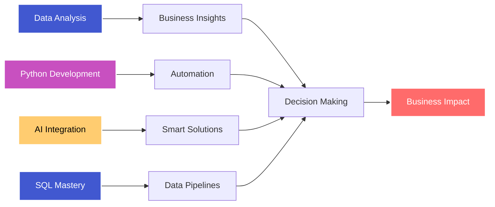

<div align="center">

<!-- Dynamic Header with Wave Animation -->


<!-- Dynamic Typing Effect -->
<div align="center">
  <a href="https://git.io/typing-svg">
    
  </a>
</div>

<!-- Elegant Badge Collection -->
<p align="center">
  
  
  
  
</p>

</div>

<br/>

<!-- Stylish Divider -->


<br/>

## 🎯 Professional Summary

<table>
<tr>
<td width="55%" valign="top">

### 👨‍💻 About Me

```python
class DataAnalyst:
    def __init__(self):
        self.name = "Vishal Mangeshbhai Patil"
        self.role = "Data Analyst"
        self.location = "Parola, Maharashtra, India"
        self.email = "vishal19042003@gmail.com"
        
    def get_expertise(self):
        return {
            "Data_Analysis": ["Python", "SQL", "NumPy", "Pandas"],
            "Visualization": ["Matplotlib", "Seaborn"],
            "Backend": ["Java", "Oracle"],
            "AI_Tools": ["LangChain", "LangGraph", "CrewAI", "LlamaIndex"],
            "Databases": ["PostgreSQL", "Qdrant", "Pinecone"],
            "Tools": ["Postman", "Git"]
        }
    
    def current_focus(self):
        return "Leveraging AI and data to drive business decisions"

me = DataAnalyst()
```

</td>
<td width="45%" valign="top">

<div align="center">
  
</div>

<br/>

### 🎓 Core Competencies

<p align="center">


</p>

</td>
</tr>
</table>

<br/>

<!-- Gradient Divider -->


<br/>

## 💼 What I Bring to the Table

<table>
<tr>
<td width="33%" align="center">

### 📊 Data Analysis


**Turning Raw Data into Gold**

- Statistical Analysis
- Data Cleaning & Preprocessing
- Pattern Recognition
- Trend Identification
- Business Intelligence

</td>
<td width="33%" align="center">

### 📈 Visualization


**Making Data Speak**

- Interactive Dashboards
- Custom Chart Design
- KPI Tracking
- Report Automation
- Storytelling with Data

</td>
<td width="33%" align="center">

### 🤖 AI Integration


**Future-Ready Solutions**

- LLM Applications
- Vector Databases
- Agent Frameworks
- RAG Systems
- AI-Powered Analytics

</td>
</tr>
</table>

<br/>

<!-- Gradient Divider -->


<br/>

## 🛠️ Technology Stack

<div align="center">

### Core Languages & Frameworks

<p align="center">
  
</p>

<table>
<tr>
<td width="50%" valign="top">

### 📊 Data Science & Analytics

<p align="center">
  
  
  
</p>

<p align="center">
  
  
  
</p>

**Key Skills:**
- Advanced data manipulation with Pandas
- Statistical analysis with NumPy
- Creating insightful visualizations
- Complex SQL query optimization
- ETL pipeline development

</td>
<td width="50%" valign="top">

### 🤖 AI & Backend Technologies

<p align="center">
  
  
  
</p>

<p align="center">
  
  
  
</p>

**Key Skills:**
- Building LLM-powered applications
- Multi-agent system design
- Backend development with Java
- Database management & optimization
- API development and testing

</td>
</tr>
</table>

<br/>

### 🗄️ Databases & Vector Stores

<p align="center">
  
  
  
</p>

**Expertise:**
- PostgreSQL for relational data
- Vector databases for AI applications
- Database design and optimization
- Query performance tuning

<br/>

### 🔧 Tools & Platforms

<p align="center">
  
  
  
  
  
</p>

</div>

<br/>

<!-- Gradient Divider -->


<br/>

## 📊 GitHub Statistics

<div align="center">

<table>
<tr>
<td width="50%">


</td>
<td width="50%">


</td>
</tr>
</table>

<br/>


<br/><br/>


<br/><br/>


</div>

<br/>

<!-- Gradient Divider -->


<br/>

## 🎯 Current Focus Areas

<div align="center">



</div>

<table align="center">
<tr>
<td width="50%" valign="top">

### 🚀 Currently Learning

- Advanced RAG techniques
- Multi-agent orchestration
- Real-time data streaming
- Cloud-based analytics platforms
- Advanced machine learning algorithms

</td>
<td width="50%" valign="top">

### 💡 Upcoming Projects

- AI-powered data analysis dashboard
- Automated reporting system
- Vector database integration project
- Predictive analytics tool
- Real-time visualization platform

</td>
</tr>
</table>

<br/>

<!-- Gradient Divider -->


<br/>

## 🤝 Let's Connect & Collaborate!

<div align="center">

<p align="center">
  <a href="mailto:vishal19042003@gmail.com">
    
  </a>
  <a href="https://linkedin.com/in/vishalpatil">
    
  </a>
  <a href="https://github.com/vishalpatil">
    
  </a>
  <a href="https://twitter.com/vishalpatil">
    
  </a>
</p>

<br/>

### 💼 Open for Opportunities In:

<p align="center">
  
  
  
  
</p>

<br/>

### 🌟 Areas of Collaboration:

<table align="center">
<tr>
<td align="center" width="25%">
<br/>
<b>Data Analytics</b>
</td>
<td align="center" width="25%">
<br/>
<b>AI Solutions</b>
</td>
<td align="center" width="25%">
<br/>
<b>Backend Development</b>
</td>
<td align="center" width="25%">
<br/>
<b>Data Visualization</b>
</td>
</tr>
</table>

</div>

<br/>

<!-- Gradient Divider -->


<br/>

## 💭 Professional Philosophy

<div align="center">

<table>
<tr>
<td width="50%" align="center">

### 📊 My Approach


</td>
<td width="50%" align="center">

### 🎯 Core Values

```yaml
mindset:
  - "Question everything"
  - "Let data speak"
  - "Automate the mundane"
  - "Visualize the complex"
  - "Learn continuously"
  
approach:
  - Clean code practices
  - Data-driven decisions
  - Collaborative spirit
  - Innovation first
```

</td>
</tr>
</table>

<br/>

### 🌟 What Drives Me

<p align="center">


</p>

</div>

<br/>

<!-- Gradient Divider -->


<br/>

## 📫 Get In Touch

<div align="center">


<br/><br/>

**💌 Email:** vishal19042003@gmail.com  
**📍 Location:** Parola, Maharashtra, India  
**💼 Status:** Open to opportunities

<br/>

### ⚡ Fun Facts About Me

- 🎯 I turn coffee into code and data into insights
- 📊 Can spot patterns in data before breakfast
- 🤖 Building AI solutions that actually make sense
- 💡 Always exploring the latest in data science
- 🚀 Believer in automation for everything

<br/>

**"Let's turn your data into your competitive advantage!"**

</div>

<br/><br/>

<!-- Animated Footer -->
<div align="center">
  
</div>

<div align="center">
  
<!-- Snake Animation -->
<picture>
  <source media="(prefers-color-scheme: dark)" srcset="https://raw.githubusercontent.com/platane/snk/output/github-contribution-grid-snake-dark.svg">
  <source media="(prefers-color-scheme: light)" srcset="https://raw.githubusercontent.com/platane/snk/output/github-contribution-grid-snake.svg">
  
</picture>

</div>
